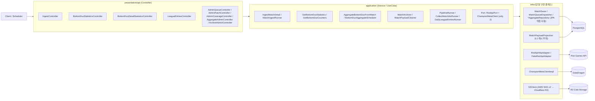
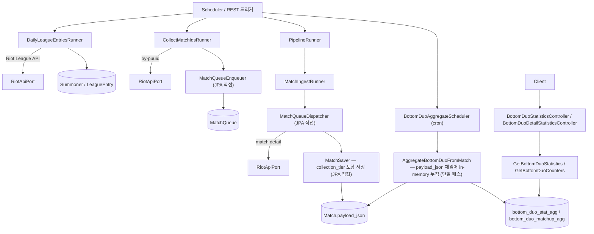

# BestDuo 백엔드 시스템 아키텍처

BestDuo 백엔드는 **Riot API 데이터 파이프라인 + 바텀 듀오 통계 집계 + Cold Storage 분리** 도메인을 담당하는 Spring Boot 4 / Java 21 기반의 백엔드입니다. 전체 코드베이스는 **3-Layer 아키텍처(presentation / application / infra)** 를 따르며, 외부 HTTP 의존성 경계 2개(`RiotApiPort`, `ChampionMetaClient`)만 Port로 추상화하고 DB 접근은 JPA Repository를 직접 사용합니다 (자세한 의사결정은 [ADR-002](./adr_3layer_transition.md) 참고). 기능은 9개 바운디드 컨텍스트(`pipeline`, `ingest`, `aggregate`, `archive`, `coverage`, `leagueentry`, `common`, `monitoring`, `config`)로 분리되어 있고, 각 컨텍스트는 모듈 성격에 따라 `presentation/api`, `application/`, `infra/persistence` 레이어 일부 또는 전부를 가집니다.

## 레이어 / 바운디드 컨텍스트

애플리케이션은 **외부 트리거(Scheduler/REST) → 프레젠테이션 → 애플리케이션 → 인프라(JPA / HTTP / S3) → 저장소(PostgreSQL / Riot API / R2)** 방향의 단방향 의존 그래프로 흐릅니다. Port는 외부 HTTP API 경계 2개에만 도입되며, DB 접근은 `infra/persistence`의 단일 클래스(Service)가 JPA Repository를 직접 호출합니다. (Port 추가 기준은 [ADR-002 §5](./adr_3layer_transition.md) 참고.)



## 파이프라인 데이터 플로우

일일 배치 파이프라인은 **LeagueEntry 수집 → MatchId 큐 적재 → 매치 상세 수집 → match 단일 저장 → payload 기반 in-memory 집계 → 집계 API 제공** 순으로 동작합니다. ADR-006 채택 이후 별도 `bottom_duo_raw` 테이블 없이 `match.payload_json` 을 재읽어 집계합니다. 증분 수집 상태는 `DailyPipelineState` / `MatchQueue` 엔티티로 영속화되어 실패 시 재개 가능한 구조입니다.



## Archive / Cleanup 데이터 플로우

과거 patch 의 `match.payload_json` 은 R2 (S3-compatible) Cold Storage 로 분리합니다. Archive 와 cleanup 은 **두 단계로 분리** 되며, cleanup 은 R2 `HeadObject` 검증 통과 후에만 row 를 지웁니다. 최신 2 patch 는 `protected_latest` 룰로 자동 보호 (운영자 실수 차단). 자세한 의사결정과 OOM 대응은 [ADR-007](./adr_archive_oom_projection.md) 참고.

```mermaid
flowchart LR
  Operator["운영자 (Admin API Key)"]

  Operator -->|POST /admin/archive/match-payload| ArchiveCtrl["ArchiveAdminController"]
  ArchiveCtrl --> Archiver["MatchArchiver"]
  Archiver -->|interface projection| Projection["MatchPayloadProjection (L1 캐시 우회)"]
  Projection --> MatchDb[("Match.payload_json")]
  Archiver -->|gzip stream → temp file| TempFile["Files.createTempFile"]
  Archiver -->|PutObject (chunked)| S3["S3Client"]
  S3 --> R2[("R2: match-archive/patch=X/tier=Y.jsonl.gz")]

  Operator -->|POST /admin/archive/cleanup-archived| CleanupCtrl["ArchiveAdminController"]
  CleanupCtrl --> Cleaner["MatchPayloadCleaner"]
  Cleaner -->|protected_latest=2 룰| Guard{"최신 2 patch?"}
  Guard -->|차단| Rejected["status: protected_latest"]
  Guard -->|통과| Head["HeadObject 검증"]
  Head -->|R2 객체 존재 확인| S3
  Head --> Delete["deleteByTierAndPatch (JPA 직접)"]
  Delete --> MatchDb
```

## 핵심 바운디드 컨텍스트

| 컨텍스트 | 역할 | 폴더 구성 | 대표 요소 |
|---|---|---|---|
| `common` | 공유 커널 + 외부 어댑터 (Port 2개 보존) | `domain/ + application/port/ + infra/{persistence,riot,champion} + presentation/api/` | `RiotApiPort`, `ChampionMetaClient`, `Match`, `MatchPayloadProjection`, `Summoner`, `PatchVersion` |
| `leagueentry` | 티어별 소환사 시드 수집 | `application/ + presentation/api/` (infra는 `common` 공유) | `LeagueEntriesController`, `DailyPipelineState` |
| `ingest` | MatchQueue / 매치 상세 수집·저장 | `application/ + infra/persistence/ + presentation/api/` | `MatchQueue`, `MatchQueueEnqueuer`, `MatchQueueDispatcher`, `MatchSaver` |
| `pipeline` | 일일 파이프라인 오케스트레이션 | `application/`만 (`@Scheduled` 전용) | `PipelineRunner`, `CollectMatchIdsRunner`, `DailyLeagueEntriesRunner` |
| `aggregate` | `match.payload_json` 기반 바텀 듀오 통계 / 매치업 집계 | `application/ + infra/{persistence,scheduler} + presentation/api/` | `AggregateBottomDuoFromMatch`, `BottomDuoAggregateScheduler`, `BottomDuoExtractor`, `GetBottomDuoStatistics`, `AggregateAdminController` |
| `archive` | Cold Storage 분리 (R2) + cleanup 안전장치 | `application/ + presentation/api/` (infra는 `common` 의 `S3Client` 공유) | `MatchArchiver`, `MatchPayloadCleaner`, `ArchiveAdminController` |
| `coverage` | 수집 커버리지 / 패치·티어 범위 관리 | `application/ + infra/persistence/ + presentation/api/` | `AdminCoverageController`, `AdminPatchController` |
| `monitoring` | Actuator / Micrometer / Prometheus 지표 노출 | 단일 폴더 | `QueryCountMonitor`, `SqlExecutionLoggingListener` |
| `config` | 공용 설정 (HTTP 클라이언트, 스케줄러, R2 등) | 단일 폴더 | `ArchiveProperties`, 빈 설정, 프로퍼티 바인딩 |

### 의도적 구조 편차

3-Layer 구조의 본질은 "모든 모듈이 3폴더"가 아니라 **"의존성 방향(presentation → application → infra) 일관성"** 입니다. 일부 모듈은 성격에 맞게 일부 폴더를 의도적으로 생략합니다:

- **`pipeline/`**: `@Scheduled` 배치 오케스트레이션 모듈로 HTTP 엔드포인트가 없고, 자체 엔티티도 없음. `application/`만 갖는 것이 모듈 성격을 정확히 표현.
- **`leagueentry/`**: 자체 엔티티 없이 `common/infra/persistence`의 Repository를 직접 사용. `infra/`를 따로 두면 DRY 위반.
- **`archive/`**: 자체 엔티티 없이 `common` 의 `Match` 와 `S3Client` (R2 어댑터) 를 공유. 저장은 R2 (외부), 삭제는 `common.MatchJpaRepository` 직접 호출.

빈 placeholder 폴더는 만들지 않습니다 (YAGNI).

## 경계 및 설계 원칙

- **Port는 외부 HTTP API 경계만**: `RiotApiPort`, `ChampionMetaClient` 2개. JPA Repository / `S3Client` 등 단순 위임 구조는 Port로 감싸지 않음 (이중 추상화 회피, [ADR-002 §5 Port 추가 기준](./adr_3layer_transition.md) 참고).
- **`*Impl` 접미사 제거**: 단일 구현만 존재하는 인프라 클래스는 인터페이스 없이 단일 클래스로 둠 (`MatchSaver`, `MatchQueueDispatcher`, `MatchArchiver` 등).
- **엔티티 = 도메인 모델**: `Match`, `MatchQueue` 등 JPA 엔티티를 도메인 모델로 그대로 사용. 별도 도메인 객체/매퍼 미도입.
- **read-only bulk 경로는 projection**: archive 같은 대용량 read-only 경로는 `MatchPayloadProjection` (interface projection) 으로 Hibernate L1 캐시 우회 ([ADR-007](./adr_archive_oom_projection.md)).
- **Raw 테이블 없이 `match.payload_json` 기반 재집계**: `bottom_duo_raw` 제거, 집계 cron 은 in-memory 누적으로 단일 패스 처리 ([ADR-006](./adr_aggregate_from_match_payload.md)).
- **상태는 Enum으로**: `MatchQueue.status` / `collectionTier` 는 Enum으로 정규화.
- **파이프라인 증분성**: `DailyPipelineState` + `MatchQueue.status` 조합으로 실패 재시도·중복 수집 방지.
- **Hot/Cold storage 분리**: hot 은 PostgreSQL, 과거 patch payload 는 R2. cleanup 은 R2 객체 존재 검증 후에만 진행, 최신 2 patch 자동 보호.
- **관측 가능성**: Actuator + Micrometer + Prometheus 로 큐 길이, 수집 처리량, Riot API 레이트리밋 지표 노출.

## 참고 문서

- [ADR-001 — 경량 헥사고날 (Superseded)](./adr_phase5_lightweight_hexagonal.md)
- [ADR-002 — 3-Layer 전환 (현행)](./adr_3layer_transition.md)
- [ADR-004 — 듀오 랭킹 점수 산출 (게임수 비중 강화)](./adr_bottom_duo_ranking_game_weight.md)
- [ADR-005 — 카운터 추천 정렬 (베이지안 스무딩)](./adr_counter_bayesian_smoothing.md)
- [ADR-006 — cron 집계 경로를 match.payload_json 기반 in-memory 누적으로 통일](./adr_aggregate_from_match_payload.md)
- [ADR-007 — Archive endpoint OOM 해결 (L1 캐시 우회 projection + temp file 스트리밍)](./adr_archive_oom_projection.md)
- [3-Layer 전환 계획서](./refactoring_to_3layer_plan.md)
- [아키텍처 비교 학습 노트](./architecture_study_3layer_vs_hexagonal.md)
- [Daily Pipeline Redesign](./daily_pipeline_redesign_plan.md)
- [Coverage Bucket Throughput 설계](./coverage_bucket_throughput_plan.md)
