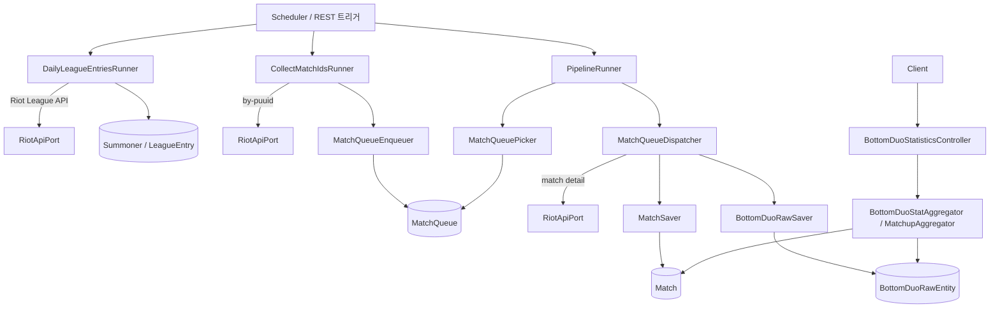

# BestDuo 백엔드 시스템 아키텍처

BestDuo 백엔드는 **Riot API 데이터 파이프라인 + 바텀 듀오 통계 집계 도메인**을 담당하는 Spring Boot 4 / Java 21 기반의 백엔드입니다. 전체 코드베이스는 **경량 헥사고날 (Lightweight Hexagonal)** 구조를 따르며, 외부 의존성 경계인 **Riot API 만 포트로 추상화**하고 JPA 엔티티는 도메인 모델로 그대로 사용합니다 (자세한 의사결정은 [ADR Phase 5](./adr_phase5_lightweight_hexagonal.md) 참고). 기능은 8개 바운디드 컨텍스트(`pipeline`, `ingest`, `aggregate`, `coverage`, `leagueentry`, `common`, `monitoring`, `config`)로 분리되어 있고, 각 컨텍스트는 `application/port`, `infra/persistence`, `presentation/api` 레이어로 구성됩니다.

## 레이어 / 바운디드 컨텍스트

애플리케이션은 크게 **외부 트리거(Scheduler/REST) → 프레젠테이션 → 애플리케이션(Port) → 인프라(HTTP/JPA Adapter) → 저장소(PostgreSQL / Riot API)** 방향의 단방향 의존 그래프로 흐릅니다. 포트 인터페이스는 `application/port` 패키지에만 정의되며, 구현체(Adapter)는 `infra/` 밑에 격리되어 테스트 시 대체 가능합니다.

```mermaid
flowchart LR
  Client["Client / Scheduler"]

  subgraph Presentation["presentation/api (Controller)"]
    IngestCtrl["IngestController"]
    StatsCtrl["BottomDuoStatisticsController"]
    MatchupCtrl["BottomDuoMatchupAggregateController"]
    DetailCtrl["BottomDuoDetailStatisticsController"]
    AggCtrl["BottomDuoAggregateController"]
    LeagueCtrl["LeagueEntriesController"]
    AdminCtrl["AdminQueueController / AdminPatchController / AdminCoverageController"]
  end

  subgraph Application["application/port (Port 인터페이스)"]
    RiotPort["RiotApiPort"]
    QueuePorts["MatchQueueEnqueuer / Picker / Dispatcher / StatusCount"]
    SavePorts["MatchSaver / BottomDuoRawSaver"]
    AggPorts["BottomDuoMatchupAggregator / StatAggregator / Finder"]
    MetaPort["ChampionMetaClient"]
  end

  subgraph Infra["infra (Adapter)"]
    RiotHttp["Riot HTTP Adapter"]
    JpaRepo["JPA Repository 구현체"]
  end

  DB[("PostgreSQL")]
  Riot[("Riot Games API")]

  Client --> Presentation
  Presentation --> Application
  Application --> Infra
  RiotHttp --> Riot
  JpaRepo --> DB
```

## 파이프라인 데이터 플로우

일일 배치 파이프라인은 **LeagueEntry 수집 → MatchId 큐 적재 → 매치 상세 수집 → 바텀 듀오 raw 저장 → 집계 API 제공** 순으로 동작합니다. 각 단계는 `pipeline` 컨텍스트의 Runner가 오케스트레이션하고, 실제 외부 호출과 저장은 모두 `common`/`ingest` 컨텍스트의 Port를 통해 수행됩니다. 증분 수집 상태는 `DailyPipelineState` / `MatchQueue` 엔티티로 영속화되어 실패 시 재개 가능한 구조입니다.

## 핵심 바운디드 컨텍스트

| 컨텍스트 | 역할 | 대표 요소 |
|---|---|---|
| `common` | Riot API 포트 + 공용 엔티티 | `RiotApiPort`, `MatchPayloadReader`, `Match`, `Summoner`, `PatchVersion` |
| `leagueentry` | 티어별 소환사 시드 수집 | `LeagueEntriesController`, `DailyPipelineState` |
| `ingest` | MatchQueue / 매치 상세 수집·저장 | `MatchQueue`, `MatchQueueEnqueuer`, `MatchSaver`, `BottomDuoRawSaver` |
| `pipeline` | 일일 파이프라인 오케스트레이션 | `PipelineRunner`, `CollectMatchIdsRunner`, `DailyLeagueEntriesRunner` |
| `aggregate` | 바텀 듀오 통계 / 매치업 집계 | `BottomDuoStatAggregator`, `BottomDuoMatchupAggregator`, `ChampionMetaClient` |
| `coverage` | 수집 커버리지 / 패치·티어 범위 관리 | `AdminCoverageController`, `AdminPatchController` |
| `monitoring` | Actuator / Micrometer / Prometheus 지표 노출 | 헬스·지표 엔드포인트 |
| `config` | 공용 설정 (HTTP 클라이언트, 스케줄러 등) | 빈 설정, 프로퍼티 바인딩 |

## 경계 및 설계 원칙

- **포트 경계 최소화**: Riot API 호출부만 포트로 추상화 (`RiotApiPort`). JPA Repository는 포트로 감싸지 않고 직접 사용 — 도메인 로직과 ORM 매핑이 충분히 가까워 이중 추상화 비용이 이득보다 큼.
- **엔티티 = 도메인 모델**: `Match`, `MatchQueue`, `BottomDuoRawEntity` 등 JPA 엔티티를 도메인 모델로 그대로 사용. 별도 도메인 객체/매퍼 미도입.
- **상태는 Enum으로**: `MatchQueue.status` / `collectionTier` 는 String → Enum 으로 정규화 ([Phase 5 리팩토링 계획](./refactoring_architecture_plan.md)).
- **파이프라인 증분성**: `DailyPipelineState` + `MatchQueue.status` 조합으로 실패 재시도·중복 수집 방지.
- **관측 가능성**: Actuator + Micrometer + Prometheus 로 큐 길이, 수집 처리량, Riot API 레이트리밋 지표 노출.

## 참고 문서

- [ADR Phase 5 — Riot API 포트 단일화 (경량 헥사고날)](./adr_phase5_lightweight_hexagonal.md)
- [Phase 5 리팩토링 계획](./refactoring_architecture_plan.md)
- [Bottom Duo Raw Pipeline 설계](./bottom_duo_raw_pipeline_plan.md)
- [Daily Pipeline Redesign](./daily_pipeline_redesign_plan.md)
- [Coverage Bucket Throughput 설계](./coverage_bucket_throughput_plan.md)
